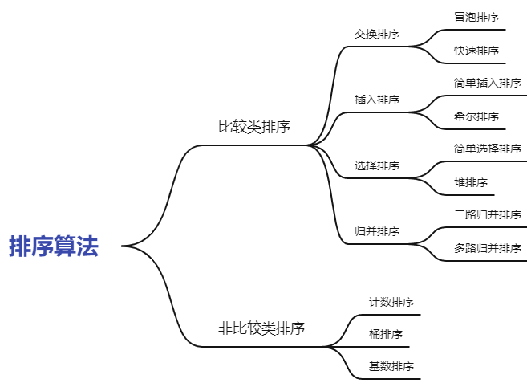

## 十种常用排序方法

1. [冒泡排序](./1.BubbleSort.md)
2. [选择排序](./2.SelectionSort.md)
3. [插入排序](./3.InsertionSort.md)
4. [归并排序](./4.MergeSort.md)
5. [快速排序](./5.QuickSort.md)
6. [堆排序]()
7. [希尔（shell）排序]()
8. [计数排序]()
9. [桶排序]()
10. [基数排序]()

### 算法分类
* 比较类排序：通过比较来决定元素间的相对次序，由于其时间复杂度不能突破O(nlogn)，因此也称为非线性时间比较类排序。
* 非比较类排序：不通过比较来决定元素间的相对次序，它可以突破基于比较排序的时间下界，以线性时间运行，因此也称为线性时间非比较类排序。

### 算法分析

|  名称  | 平均时间复杂度 | 最好时间复杂度 | 最坏时间复杂度 | 空间复杂度 | 稳定性 |
|:------| :---------- | :----------- | :---------- | :------- | :---- |
| 冒泡排序 | O(n²) | O(n²) | O(n²) | O(1) | 稳定 |
| 选择排序 | O(n²) | O(n²) | O(n²) | O(1) | 不稳定 |
| 插入排序 | O(n²) | O(n²) | O(n²) | O(1) | 稳定 |
| 归并排序 | O(nlogn) | O(nlogn) | O(nlogn) | O(n) | 稳定 |
| 快速排序 | O(nlogn) | O(nlogn) | O(n²) | O(logn) | 不稳定 |

### 相关概念
* 稳定性：通俗地讲，在一个序列中，排序之前，a在b之前，且a=b,如果排序之后a仍然在b之前，那么就是稳定的，反之就是不稳定的。
